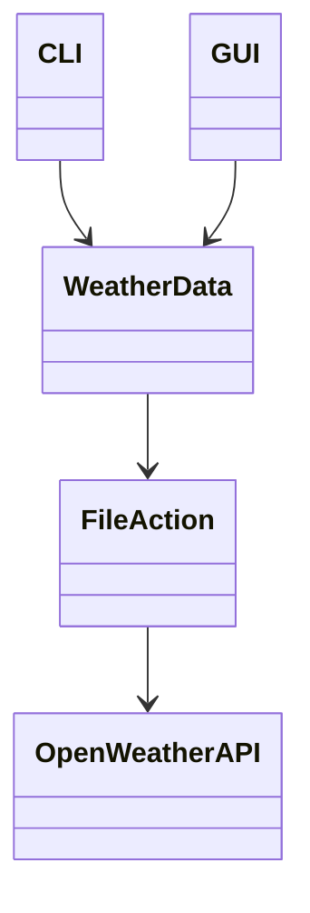
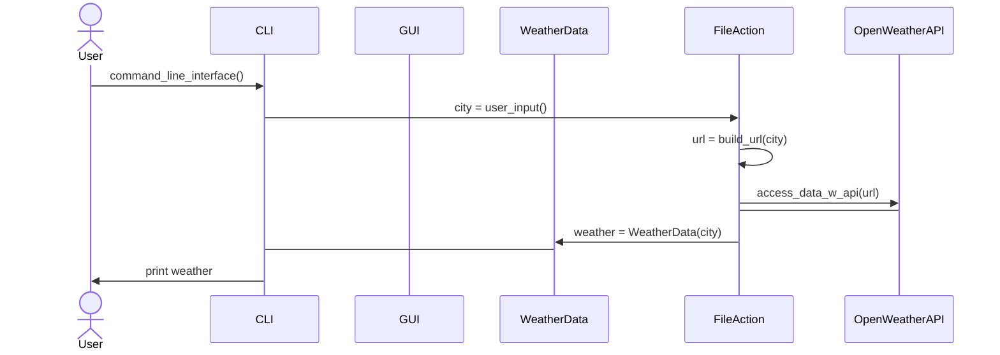

# Alustava luokkakaavio

```mermaid
classDiagram
CLI --> WeatherData
WeatherData --> FileAction
GUI --> WeatherData
FileAction --> OpenWeatherAPI

```

# Komentorivikäyttöliittymää kuvaava sekvenssikaavio

```mermaid
sequenceDiagram
actor User
participant CLI
participant GUI
participant WeatherData
participant GUI
participant FileAction
participant OpenWeatherAPI

User->>CLI: command_line_interface()
CLI->>FileAction: city = user_input()
FileAction->>FileAction: url = build_url(city)
FileAction->>OpenWeatherAPI: access_data_w_api(url)
OpenWeatherAPI->FileAction: 
FileAction->>WeatherData: weather = WeatherData(city)
WeatherData->CLI: 
CLI->>User: print weather

```