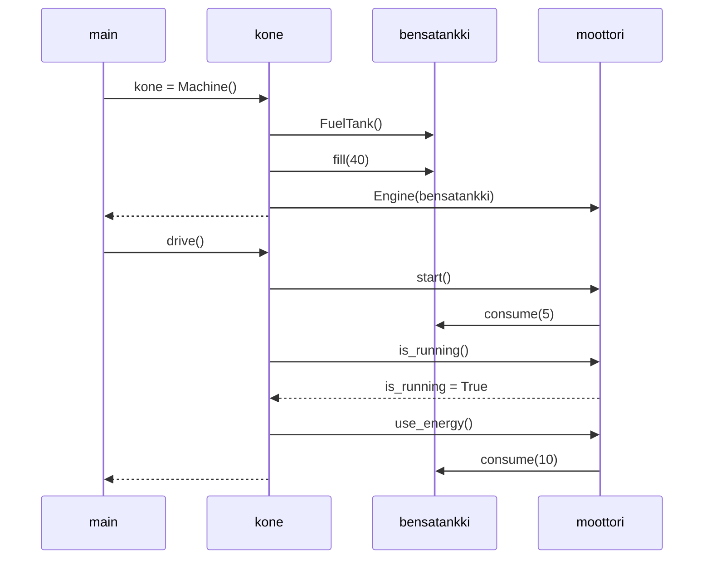

Tarkastellaan bensatankista ja moottorista koostuvan koneen Python-koodia.

Piirrä sekvenssikaaviona tilanne, jossa kutsutaan (jostain koodin ulkopuolella olevasta metodista) ensin **Machine-luokan konstruktoria** ja sen jälkeen luodun **Machine-olion metodia drive**.

Muista, että sekvenssikaaviossa tulee tulla ilmi kaikki mainin suorituksen aikaansaamat olioiden luomiset ja metodien kutsut!

